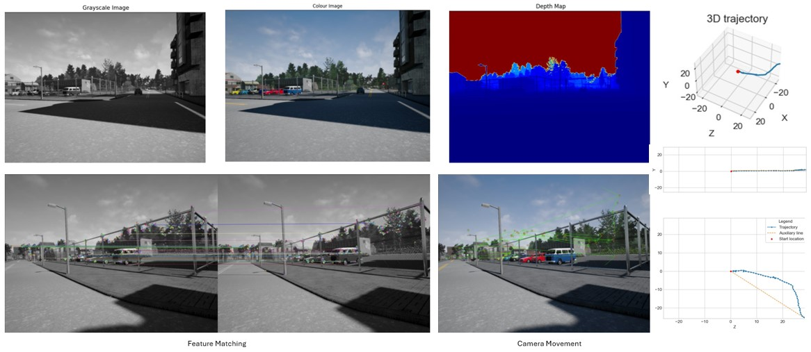

# Visual Odometry
Visual Odometry with feature extraction and matching techniques to estimate camera motion.

### Project Overview

Visual odometry is a technique that allows a robot or vehicle to estimate its position and orientation by analyzing sequences of images captured by a camera onboard. This project implements a basic visual odometry pipeline using feature extraction and matching algorithms.

### Dependencies

The script relies on the following Python libraries:

* numpy
* cv2 (OpenCV)
* matplotlib
* m2bk.py (custom module containing dataset handling functions)
* features_algo.py (custom module containing feature extraction and matching functions)

Make sure these libraries are installed before running the script.

### Script Breakdown

The core functionalities are implemented in two separate Python files:

* **m2bk.py:** This file defines the `DatasetHandler` class responsible for:
    * Loading and storing the image dataset and depth maps.
    * Reading camera intrinsic parameters.
    * Visualizing camera movement based on matched features.
    * Visualizing the estimated camera trajectory.

* **features_algo.py:** This file contains functions for:
    * Feature extraction using ORB algorithm.
    * Feature visualization.
    * Feature matching using FLANN matcher.
    * Filtering good matches based on distance ratio.
    * Estimating camera motion using Essential Matrix Decomposition (or PnP with RANSAC) for subsequent image pairs.
    * Building the complete camera trajectory across the entire image sequence.

### Running the Script

1. Ensure you have all the required libraries installed (refer to Dependencies section).
2. Place the script (along with `m2bk.py` and `features_algo.py`) in the same directory containing the image dataset (`rgb`) and depth map dataset (`depth`).
3. Run the script using the following command in your terminal:

```bash
python visual_odometry.py
```

### Script Output

The script generates the following outputs:

* **Matched feature visualization:** This visualization displays corresponding features (points) identified in consecutive image frames.
* **Camera trajectory:** The script estimates and visualizes the 3D trajectory of the camera throughout the image sequence.

<div align="left">
<br><br>
</div>

### Note

This is a basic implementation of visual odometry. More sophisticated techniques can be applied to improve the accuracy and robustness of the results, such as:

* Using more advanced feature detectors and descriptors (e.g., SIFT, SURF).
* Bundle adjustment for global optimization of camera poses and 3D structure.
* Incorporating loop closure detection to handle revisiting locations.

This project provides a starting point for exploring visual odometry concepts and experimenting with feature-based motion estimation techniques.

